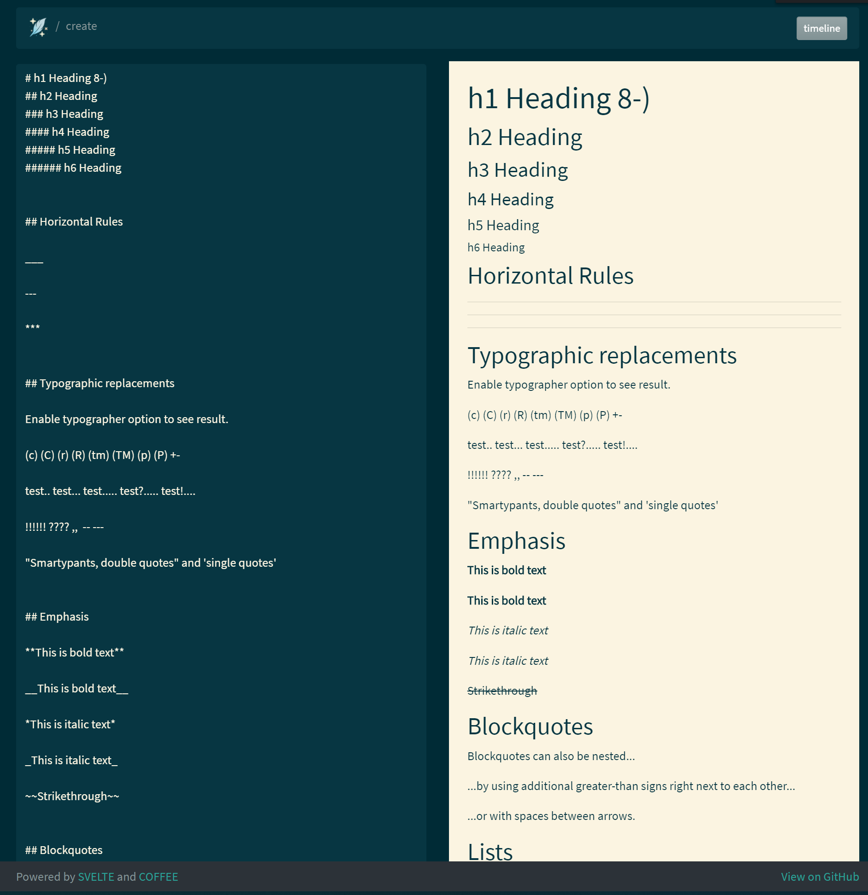

<p>
  <a href="https://www.npmjs.com/package/museful" target="_blank">
    
  </a>
  <a href="https://github.com/leenattress/museful#readme" target="_blank">
    
  </a>
  <a href="https://github.com/leenattress/museful/graphs/commit-activity" target="_blank">
    
  </a>
  <a href="https://github.com/leenattress/museful/blob/master/LICENSE" target="_blank">
    
  </a>
  <a href="https://twitter.com/leenattress" target="_blank">
    
  </a>
</p>

> museful is a terminal application that lets developers on a project have more meaningful discussion with anybody interested in the source code than just commit messages.

### 🏠 [Homepage](https://github.com/leenattress/museful)

## Install

```sh
npm i museful -g
```

## Add to Project

```sh
museful init
```

## Create a musing

```sh
museful new
```

## See Timeline

```sh
museful
```

## Build for CI/CD

```sh
museful build
```

## Features

- Create a timeline of thoughts, or discussion inside your project
- Content is markdown text
- Easily edit with the provided web interface, or in your favourite markdown, text editor or development IDE
- Generate a website for public (or team) to read.
- No database, very simple to set up and use
- Super simple single command: `museful`
- Musings are committed along with code for review



## Current Project State

This is an early release and might not be ready for production right now due to bugs and other madness.

## Author

👤 **Lee Nattress (http://leenattress.com)**

* Twitter: [@leenattress](https://twitter.com/leenattress)
* Github: [@leenattress](https://github.com/leenattress)
* LinkedIn: [@leenattress](https://linkedin.com/in/leenattress)

## 🤝 Contributing

Contributions, issues and feature requests are welcome!<br />Feel free to check [issues page](https://github.com/leenattress/museful/issues). You can also take a look at the [contributing guide](https://github.com/leenattress/museful/blob/master/CONTRIBUTING.md).

## Show your support

Give a ⭐️ if this project helped you!

<a href="https://www.patreon.com/leenattress">
  
</a>

<a href="https://ko-fi.com/leenattress">
  
</a>


## 📝 License

Copyright © 2020 [Lee Nattress <leenattress1981@gmail.com> (http://leenattress.com)](https://github.com/leenattress).<br />
This project is [ISC](https://github.com/leenattress/museful/blob/master/LICENSE) licensed.

***
_This README was generated with ❤️ by [readme-md-generator](https://github.com/kefranabg/readme-md-generator)_