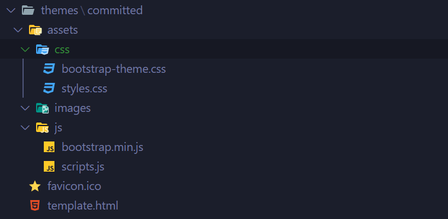

# Template language and concepts



## As simple as a single html file

museful uses [Nunjucks](https://mozilla.github.io/nunjucks/) for it's templates and you will find only a single file in the theme folder: `template.html`.

This page contains all the necessary logic to create not only the homepage and it's numbered indexes, but the blog content page. Remember that museful is a minimal blog engine, so we deliberately dont get complicated. We want the simplest possible blog.

Each markdown you'll notice has some metadata at the top. This is not rendered as part of the page, but rather extracted and available in the Nunjucks template. This is the structure of the data available in the Nunjucks page:

- `{{pageTitle}}` is the title found in the markdown meta-data.
- `{{pageDate}}` is the data found in the markdown meta-data.
- `{{pageContent}}` is the html, rendered using the markdown found in the remainder of the file.
- `{{pageLink}}` is the filename of this file, with a html extension.
- `{{pageFeaturedImage}}` is the path to a featured image for this blog entry.
- `{{siteConfig}}` is the config, found in `museful.json`

`{{siteConfig}}`, by default contains the title of your blog, as well as any data you see fit to put in there.

You can access the data like this: `{{siteConfig.title}}` or `{{siteConfig.url}}`.

## museful.json

A typical config file might look something like this:

```
{
  "title": "Project Musings",
  "description": "This project info can be changed in the museful.json file",
  "theme": "committed",
  "articlesPerPage": 32,
  "themeData": {
    "headerOverlayColour": "rgba(7, 54, 66, 0.6)",
    "primaryColour": "rgba(7, 54, 66, 0.6)",
    "projectLogo": "assets/images/logo.png"
  },
  "output": "docs",
  "input": "musings/src"
}

```

Since this object is passed into every theme, it's a good place to put things like analytics keys.

> ⚠ Do not put anything private here, consider this file public ⚠

For more help creating a template in Nunjucks [see here](https://mozilla.github.io/nunjucks/templating.html), or open `template.html` in your favourite editor to take a look at a simple example, with loops and conditional statements in Nunjucks.

You can of course, make this use any framework or any design you like. For this theme, called `committed` (get it ;) I used [Bootstrap 4](https://getbootstrap.com/)

[<< Back](README.md)